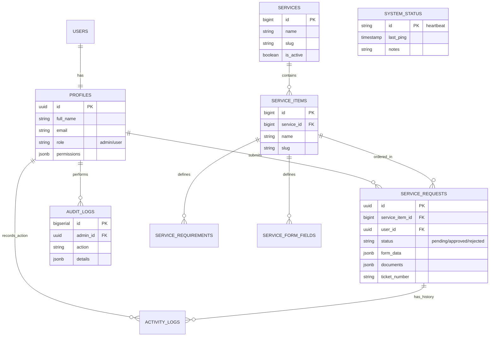

# Entity Relationship Diagram (ERD): PTSP Kemenag Barito Utara

Berikut adalah visualisasi struktur database modular yang kita gunakan.

## Deskripsi Relasi:
1. **Users & Profiles**: Relasi 1:1 antara tabel sistem auth Supabase dengan profil pengguna aplikasi.
2. **Services & Items**: Satu kategori layanan (Services) bisa memiliki banyak jenis layanan (Service Items).
3. **Requests**: Jantung dari aplikasi, menghubungkan User dengan Service Item yang dipilih serta menyimpan data form dan dokumen.
4. **Logs**: `Audit Logs` memantau aktivitas admin, sedangkan `Activity Logs` memantau riwayat perjalanan sebuah pengajuan (tracking).
5. **System Status**: Digunakan untuk aktivitas heartbeat agar database tidak dipause.
